# Animal class

## Constructor
```cs
abstract class Animal(Random rng, Position pos);

class Herbivore(Random rng, Position pos, IAnimalParams parameters) : Animal(rng, pos);

class Carnivore(Random rng, Position pos, IAnimalParams parameters) : Animal(rng, pos);
``` 

When the animal is created it is assigned a ID based on the base id given in the program. ID = base+1, and then increments the base value.  
The starting weight of the animal is given by the normal distribution:  
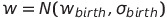

---
## Parameters 
Animal parameters available to the program
### General
```cs
int ID // The unique id of this animal.

int Age

Position Pos // The current position of the animal x and y coordinate.

Position GoingToMoveTo // The cell this animal will move to in the next cycle

double Weight 

IAnimalParams Params // Object containing the behaviour parameters of this animal

bool IsAlive // Indicates if this animal is alive

bool Tracked // Indivates if this animal is currently being tracked

bool InheritTracking // If true, then any offspring of this animal will also be added to the tracking array in the simulation

bool GivenBirth // Indicates if this animal has given birth this cycle

bool Migrated // Indicates if this animal has migrated this cycle

int NumberOfBirths  // Number of times this animal has given birth

List<int> Parents  // List of parent ID of this element
```

### Fitness
Many behaviours are dependant of the animals fitness. 
```cs
double Qplus
double Qneg
double Fitness => Qplus * Qneg;
```

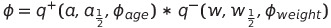  

The calculation is done in two steps using the variables Qneg and Qplus  
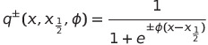


---   
## General Methods

### **Birth**
```cs
IAnimal Birth(int sameSpeciesInCell);
```  
The animal can give birth one time per year. This is governed by the number of animals of the same type in the same cell, the animal's age, weight, and the animal parameter `gamma`. If the birth is successful, it will return a new animal of it's own type with the same parameter values of the parent. 
The probability of birth is given by this equation:  
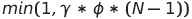  

The probability of birth is also zero if the weight of the child will be too large for the parent to bare. As given by this equation:  

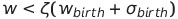

If the animal gives birth, it will lose mass equal to:  
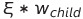
### **Death**
```cs
void Death();
```  
Every year the probability of the animal dying is given by:  
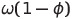  
Where omega is the "general" risk/factor of death.  

### **Migrate**
```cs
void Migrate(List<Position> dir);
```  
The animal is given a list of available cells it is allowed to move to according to the main [simulation class](../Simulation/README.md#Migration). The animal will decide if it wants to move according to:  
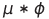  
Then the animal draws randomly from the list of available cells and set's it's [GoingToMoveTo](#parameters) parameter to either the current cell, if it does not want to move, or the cell it wishes to move to.    

### **Update Weight**
```cs
void UpdateWeight(); 
```  
Simulates the annual weight loss of the animal. Each year the animal loses weight according to:  
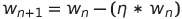

### **Grow Older**
```cs
void GrowOlder(); 
```  
Increment the animals age by one.  

### **Kill**
```cs
bool Kill();
```  
This method is used to kill the individual during the simulation. The method will check if the animal is currently alive, "kill" it by setting it's alive parameter to false and return true if the animal was living, and is now dead.  

### **Update Parameters**
```cs
void UpdateParameters(IAnimalParams newParameters);
```  
This method will update the parameter object on the animal with new values.  

### **Randomly Change Parameters** (not implemented)
```cs
void RandomParameterChange();
```  
This method will randomly alter one parameter by a random weighted amount.  

### **Selective Pressure** (not implemented)
```cs
void SelectivePressure();
```  

### **Track**
```cs
bool Track();
```  
Sets the tracking property on the animal to `true`.  

### **Untrack**
```cs
bool Untrack();
```  
Sets the tracking property on the animal to `false`.   

### **Log Tracked Animal**
```cs
AnimalModel LogTrackedAnimal();
```
Returns a AnimalModel representation of the critical values of the animal, such as weight, age, fitness etc.   

---  
## Herbivore exclusive Methods

### **Feed**
```cs
double Feed(double availableFood);
```
The herbivore feeds on available food in the cell according to it's parameter `F`.  
The animal will try to eat `F` amount of food in the cell and return the resulting amount, if available < F, then it will eat all reamaining food. After feeding, the herbivore will increase it's weight according to:  
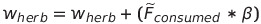    

---  
## Carnivore exclusive Methods

### **Feed**
```cs
int Feed(List<Herbivore> herbivores);
```
The Carnivore feeds on herbivores based on fitness. The carnivore will go through all living herbivores in the same cell, starting with the lowest fitness. The probability that the carnivore will kill the herbivore is given by this set of equations:    
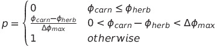  
The carnivore will continue to feed until it has eaten herbivores with total mass >= `F` or there are no more living herbivores in the cell.  
When feeding is complete, the carnivores weight will increase according to:  
  

### **Kill Herbivore**  
```cs
double KillHerbivore(Herbivore herbivore);
```
Kills the given herbivore and returns the mass of the herbivore times the carnivores `Beta` parameter.   