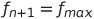

# Enviroment class
Constructors 
```cs
abstract class Enviroment(Position pos, Random rng, DatabaseHandler dbHandler, List<Herbivore> intital herbivores, List<Carnivores> initialCarnivores);

class Desert(Position pos, Random rng, DatabaseHandler databaseHandler, List<Herbivore> initialHerbivores = null, List<Carnivore> initialCarnivores = null) : Enviroment(pos, rng, databaseHandler, initialHerbivores, initialCarnivores);

class Ocean(Position pos, Random rng, DatabaseHandler dbHandler) : Enviroment(pos, rng, dbHandler);

class Mountain(Position pos, Random rng, DatabaseHandler dbHandler) : Enviroment(pos, rng, dbHandler);

class Savannah(Position pos, Random rng, DatabaseHandler databaseHandler, List<Herbivore> initialHerbivores = null, List<Carnivore> initialCarnivores = null) : Enviroment(pos, rng, databaseHandler, initialHerbivores, initialCarnivores);

class Jungle(Position pos, Random rng, DatabaseHandler databaseHandler, List<Herbivore> initialHerbivores = null, List<Carnivore> initialCarnivores = null) : Enviroment(pos, rng, databaseHandler, initialHerbivores, initialCarnivores);

```  

## Properties
All exposed properties for a single cell. A cell only cares about it's own parameters and animals and does not know or interact with any neighboring cells.  
```cs
Random Rng // rng class for all animals and operations in the cell (inherited from main simulation)
bool Passable // Inidcates if a animal can move into this cell
Position Pos // The x y position of the cell on the grid
List<Herbivore> Herbivores  // All herbivores in the cell 
List<Carnivore> Carnivores  // All carnivores in the cell
double Food // Amount of food available to herbivores
int NumberOfHerbivores // The number of herbivores
int NumberOfCarnivores // The number of carnivores
int TotalIndividuals // The total number of individuals
double CarnivoreFood // The total mass of all living herbivores
int KilledByCarnivores // Number of herbivores killed by carnivores this cycle
int DeadCarnivores // Total carnivore deaths
int DeadHerbivores // Total herbivore deaths
int NewHerbivores // New herbivores born this year
int NewCarnivores // New carnivores born this year
double HerbivoreAvgFitness // The average fitness value of all herbivores
double CarnivoreAvgFitness // The average fitness value of all carnivores
EnvParams Params // The cell "parameter" object
double HerbivoreAvgWeight // Average weight of herbivores
double CarnivoreAvgWeight // Average weight of carnivores
double HerbivoreAvgAge // Average age of herbivores
double CarnivoreAvgAge // Average age of carnivores
int TotalCarnivoreLives // Total number of carnivores born or created
int TotalHerbivoreLives // Total number of herbivores born or created
double PeakHerbivoreFitness // Peak fitness value for herbivores this year
double PeakCarnivoreFitness // Peak fitness value for carnivores this year
double PeakHerbivoreAge // Peak age for herbivores this year
double PeakCarnivoreAge // Peak age for carnivores this year
double PeakHerbivoreWeight // Peak weight for herbivores this year
double PeakCarnivoreWeight // Peak weight for carnivores this year
DatabaseHandler DBhandler // Database handler object. (WILL BE REMOVED)
```

## Methods
```cs
void GrowFood();
```
The GrowFood() method is only available on the Savannah and Jungle cells. This method sets the amount of available food in the cell according to the cell's parameter object.  
For jungle cells food grows according to:  
  
For savannah cells food grows according to:  
  

```cs
void LogData(LogWriter logger);
```   
Writes a set of critical data to the logger object. 


```cs
void HerbivoreFeedingCycle();
```   

```cs
void CarnivoreFeedingCycle();
```   

```cs
void ResetCurrentYearParameters();
```   

```cs
void DeathCycle();
```   

```cs
void BirthCycle();
```   

```cs
int ResetGivenBirthParameter(); 
```   

```cs
int ResetMigrationParameter();
```   

```cs
void AgeCycle();
```   

```cs
void WeightLossCycle();
```   

```cs
void RemoveDeadIndividuals();
```   

```cs
void OverloadParameters(IAnimal animal, IAnimalParams parameters);
```   

```cs
void OverloadParameters(int index, string type, IAnimalParams parameters);
```   

```cs
void OverloadAllHerbivores(HerbivoreParams parameters);
```   

```cs
void OverloadAllCarnivores(CarnivoreParams parameters);
```