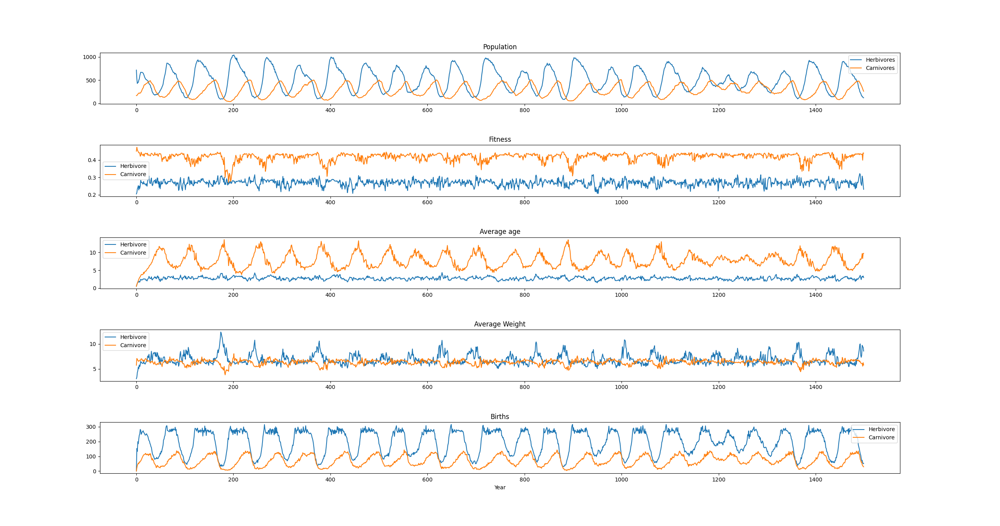

# BioSim Project

[?branchName=Dev)](https://dev.azure.com/thewisetorsk/BioSim/_build/latest?definitionId=4&branchName=Dev)

__What is it?__
Simulates an island and some basic animals in it. Animals can interact with each other and the enviroment they occupy. This impacts the fitness of the animals.
__Annual cycle:__

* Food Grows in each cell
* Herbivores feed on grown food in cell
* Carnivores hunt and feed on herbiovres
* Dead herbivores are removed from enviroment
* Animals mate and give birth to offspring
* Animals migrate to neighboring cells
* Animals grow older
* Animals have a "chance" to die
* Dead animals are removed from enviroment


---

## __Dependencies__
Animal generation uses [MathNet.Numerics](https://www.nuget.org/packages/MathNet.Numerics). (NuGet)  
Output Images uses System.Drawing. Not typically available by default in a console app, add using NuGet.  
Data post processing and visualization uses ffmpeg & python 3 with numpy and matplotlib.  
FFmpeg is available through Chocolatey or directly from [ffmpeg.org](https://www.ffmpeg.org).  
Automatic installation of all depenencies may be available through install script in the future.  

---

## __Features__
Main simulation runs as a console app, with possibilities to control and alter parameters through a MVC web interface.  
Control of the simulation while running will be implemented as a form of scripting, where actions/commands can be defined in a custom file that executes the given command at a set time in the simulation.  


### **Scripting** (Experimental)
Script can be defined in a given directory.   
Save script file with .biosim extention. `script.biosim`  
Scripts will follow the given pattern: `<year> <command> <parameters>;`  
End of line or semicolon `;` Defines the end of a command line.   
Animals can also be added using a later defined pattern to also include custom paramters for said animals  
Program will create a overview of commands sorted after year it will be executed and evaluetes them while the simulation runs.  
A line will be skipped if it contains double forward slash `//`  

#### **Commands**
Main [Command](Biosim/Tools/README.md#command) class
* `InsertAnimals <xy cell coordinates> <pattern>`
* `RemoveAnimals <xy cell coordinates> <pattern>`
> Pattern :  
> \<amount\> \<type\> \<parametername\>:\<value\> \<parametername\>:\<value\> \<parametername\>:\<value\> etc...   
* `HerbivoreCap <xy cell coordinates> <int>`
* `CarnivoreCap <xy cell coordinates> <int>`
* `CellFoodMax` 
* `CellFood <xy cell coordinates> <double>`
* `Passable <xy cell coordinates> <bool>` // Posibility to control the "passable" parameter of individual cells
* `UpdateAnimalParameters <xy cell coordinates> <all/animalId/numberOfAnimals> <parameter pattern>` // Requires more in depth information

##### UpdateAnimalParameters
Updates the animal parameters of either all animals in the cell, all animals of one type in the cell, or a set of animals within the cell.  

### **Results** 
Simulation object can generate output graphs as png through python. Data is saved as csv files available in the *Results* folder.  

#### Current output csv files:
* *simResult.csv* - Global overview of island population and average "life" parameters.  
* *HerbivorePopulation.csv* - Cell by cell overview of Herbivore population by year.  
* *CarnivorePopulation.csv* - Cell by cell overview of Carnivore population by year.  
* *herbivoreparams.csv* - List of starting parameters for a default herbivore.  
* *carnivoreparams.csv* - List of starting parameters for a default carnivore.  

#### Other output files:  
* *island.png* is a bitmap image of the island the simulation has been run on.  
* Simulation will automatically display a graph of the overall life on the island.  
* The simulation can also generate a set of images that illustrates the population density per cell per year.   
* These image sets can be assembled into two mp4 videos showing the population dynamics over time.  
* After both videos have been generated, the user can run a batch file in the mp4 folder that stitches the two video files into a single video showing both populations side by side.  

    
#### Island.png description
* Yellow - Savannah
* Brown - Desert
* Gray - Mountain
* Green - Jungle
* Blue - Ocean  

[Video of population dynamics](https://youtu.be/4TIqHmvlsSA)  
  


Typical result of a sucessfull simulation of 1500 years.  

***

## **Classes**
### **Sim**
Main simulation class can be instanced using this constructor  
```cs
Sim(int yearsToSimulate, string template, bool noMigration);
```
__Parameters:__
- yearsToSimulate -> `integer` value for the maximum amount of years the simulation is allowed to run.  
- template -> `string` representing the layout of the island to be simulated using "newline" char for linebreak. ex: `"DDDD\nSSSS\nMMMM\nJJJJ"` is a four by four island with four "Desert" cells, four "Savannah" cells, four "Mountain" cells, and four "Jungle" cells.  

__Cell types:__
Ocean and Mountain cells are impassable and uninhabitable to animals  
- `"S"` - Savannah
- `"J"` - Jungle
- `"D"` - Desert
- `"M"` - Mountain
- `"O"` - Ocean

* noMigration -> `bool` value deciding wether animals are allowed to move between cells   

#### Run
Simulation can be started by invoking the method ```Sim.Simulate();```  
The simulation will run until one of two arguments is met:   
- All animals are dead    
- Current simulated year == yearsToSimulate  

### **Animal**
Main [Animal](Biosim/Animals/README.md) class  
Animal class contains the main animal type of the simulant on the island.  

### **Enviroment**
Main [Enviroment](Biosim/Land/README.md) class  
!!! THE DATABASE HANDLER SHOULD BE REMOVED FROM THE ENVIROMENT CLASS !!!


### **Parameters**
The [parameter](Biosim/Parameters/README.md) class and subclasses decide the behaviour of the animals based on animal class (herbivoreParams/carnivoreParams) and the available food and re-growth rate of food in the island cells.  
 
### **Tools**
[Tools](Biosim/Tools/README.md) contains a set of tools and objects the simulation uses to process data as the simulation runs and post run.  

---

## **WebInterface**
[WebInterface](WebInterface/README.md)

---

## **Future***
Gather all simulation settings and initial conditions into a file that can be defined by the user. And stored in the same folder as the executable.    
Optimisation of code  
Parallel LinQ  
Parallel computing?  
Use of Parallel.ForEach() for individual cell operations.  

### *SimulationSettings files*
A user defined file, or set of files, that controls the initial conditions and prograssion of the simulation over time.

**Settings folder**  
↳ herbivore.parameters - Collection of "default" parameters and values for herbivores  
↳ carnivore.parameters - Collection of "default" parameters and values for carnivores  
↳ island.map - String representation of island  
↳ island.population - "Map" of starting populations and starting parameters (Weight, Age) to override default    
↳ script.biosim - List of commands per year
↳ sim.initials - Settings for the initiation of the simulation. (years to simulate, additional conditions etc. etc.)  

One file for each animal types starting parameters.  

## **Possible issues**
- Animal movement accross a mountain range needs more testing. 

### Command parsing and execution fixes
- Add posibility to execute multiple commands per year. Currently the program only allows one command per year   


### Notes
Equations generated using [Sciweavers online LaTeX editor](http://www.sciweavers.org/free-online-latex-equation-editor)  